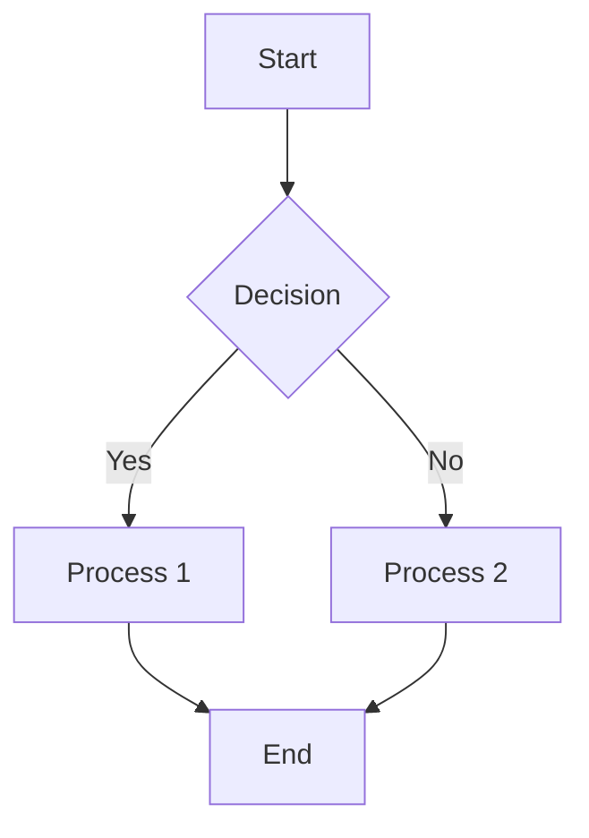
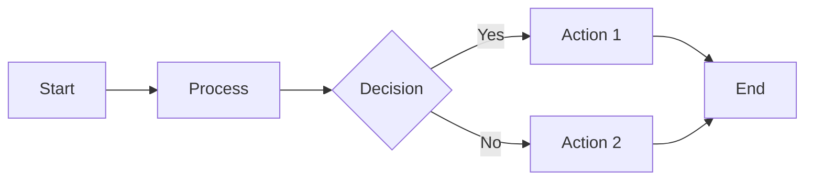
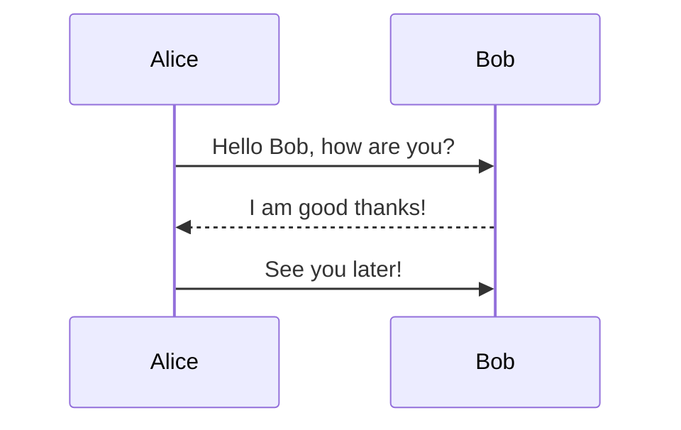
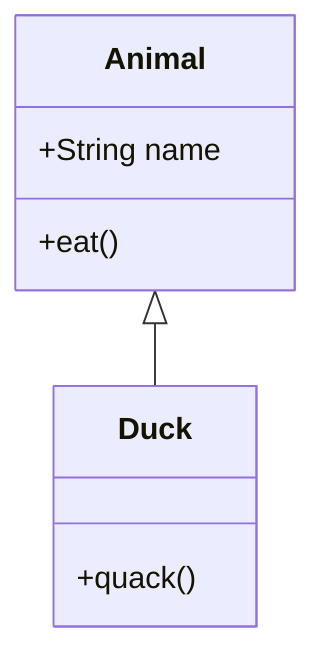
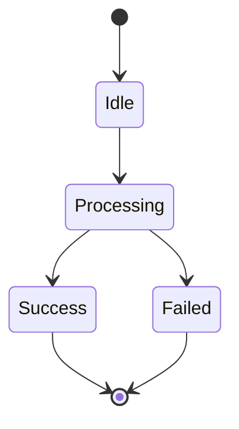
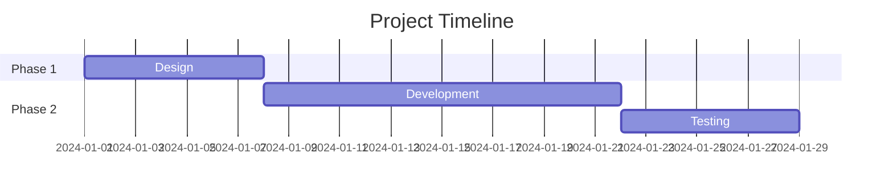
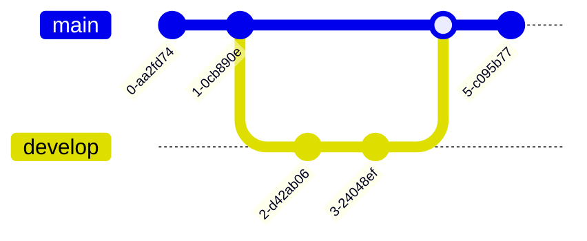
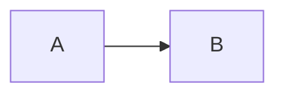

# Mermaid Expert

Expert guidance for Mermaid.js, the powerful JavaScript library for creating diagrams and visualizations using text-based syntax. Mermaid transforms simple text descriptions into professional-looking diagrams that can be embedded in documentation, presentations, and web applications.

## Additional Resources

For comprehensive documentation and advanced features, see the [Mermaid Source Documentation](docs/snapshot/v11.12.1/) which includes:
- [Flow Charts Guide](docs/snapshot/v11.12.1/flow_charts.md) - Complete flowchart syntax and examples

For integration details and configuration options, refer to the main documentation at [docs/snapshot/v11.12.1/](docs/snapshot/v11.12.1/).

## Core Concepts

**Mermaid is a text-to-diagram tool that allows you to create:**
- Flowcharts for processes and decision trees
- Sequence diagrams for interactions and timelines
- Class diagrams for software architecture
- State diagrams for finite state machines
- Gantt charts for project management
- Git graphs for version control visualization
- Block diagrams for system layouts

### Getting Started

**Basic Mermaid syntax structure:**
```mermaid
diagramType
    [diagram content]
```

**Simple flowchart example:**


### Installation and Setup

**In HTML:**
```html
<script src="https://cdn.jsdelivr.net/npm/mermaid/dist/mermaid.min.js"></script>
```

**In Markdown/Documentation:**
Most modern platforms (GitHub, GitLab, Notion) support Mermaid natively using code blocks with `mermaid` language identifier.

**Node.js/npm:**
```bash
npm install mermaid
```

### Command Line Interface

**For flowchart diagrams only: mmdr (mermaid-rs-renderer)**

[mmdr](https://github.com/1jehuang/mermaid-rs-renderer) is a fast native Rust renderer for **flowchart diagrams only**. It is ~1000x faster than mermaid-cli and requires no browser or Node.js.

**Check if installed:**
```bash
mmdr --version
```

If not found, install from: https://github.com/1jehuang/mermaid-rs-renderer

**Usage (flowcharts only):**
```bash
# Pipe to stdout
echo 'flowchart LR; A-->B-->C' | mmdr -e svg

# File to file
mmdr -i diagram.mmd -o output.svg -e svg
```

**For all other diagram types: mermaid-cli**

**Check if installed:**
```bash
mmdc --version
```

If not found, install from: https://github.com/mermaid-js/mermaid-cli

```bash
# Convert to SVG
mmdc -i input.mmd -o output.svg

# Convert to PNG with dark theme
mmdc -i input.mmd -o output.png -t dark -b transparent

# Process markdown files
mmdc -i readme.template.md -o readme.md
```

## Flow Charts

### Basic Flowchart



### Flowchart Syntax

- `flowchart TD` - Top Down direction
- `flowchart LR` - Left to Right direction
- `A[Text]` - Rectangle node
- `A{Text}` - Diamond decision node
- `A((Text))` - Circle node
- `A>Text]` - Stadium shape
- `A --> B` - Arrow connection
- `A -->|Label| B` - Labeled arrow

## Sequence Diagrams

### Basic Sequence Diagram



### Sequence Diagram Syntax

- `participant Name` - Define participant
- `A->>B: Message` - Synchronous message
- `A-->B: Message` - Async message (dashed line)
- `A-->>B: Message` - Return message
- `rect rgb(...)` - Group messages
- `loop / alt / opt` - Control structures

## Class Diagrams

### Basic Class Diagram



### Class Diagram Syntax

- `class ClassName{ ... }` - Define class
- `+Type name` - Public member
- `-Type name` - Private member
- `methodName()` - Method
- `Child <|-- Parent` - Inheritance
- `A *-- B` - Composition
- `A o-- B` - Aggregation

## State Diagrams

### Basic State Diagram



### State Diagram Syntax

- `[*]` - Start/end state
- `A --> B` - Transition
- `A: event` - Triggered transition
- `state A { ... }` - Composite state
- `[*] --> A` - Initial state

## Gantt Charts

### Basic Gantt Chart



### Gantt Syntax

- `title Text` - Chart title
- `dateFormat YYYY-MM-DD` - Date format
- `section Name` - Section header
- `Task :id, start, duration` - Define task
- `after taskId` - Dependency

## Git Graphs

### Basic Git Graph



### Git Graph Syntax

- `commit` - Create commit
- `branch name` - Create branch
- `checkout name` - Switch branch
- `merge name` - Merge branch
- `cherry-pick id` - Cherry-pick commit

## Block Diagrams

### Basic Block Diagram

```mermaid
block-beta
    columns 1
    block:db:1
      database[(Database)]
    end
    block:app:2
      service[Service]
      api[API]
    end
    db -- API
```

### Block Diagram Syntax

- `block:name:width` - Define block
- `node[(Text)]` - Rounded node
- `node[Text]` - Square node
- `A -- B` - Connection
- `columns N` - Column layout

## Integration and Usage

### In Markdown

Most platforms support Mermaid natively:

````markdown

````

### In HTML

```html
<script src="https://cdn.jsdelivr.net/npm/mermaid/dist/mermaid.min.js"></script>
<div class="mermaid">
flowchart LR
    A --> B
</div>
```

### In JavaScript

```javascript
import mermaid from 'mermaid';

mermaid.initialize({ startOnLoad: true });

// Render programmatically
const diagram = await mermaid.render('diagram-id', 'flowchart LR\nA-->B');
```

## Best Practices

1. **Keep diagrams simple** - Complex diagrams are hard to read
2. **Use consistent styling** - Same shapes for similar elements
3. **Add labels to connections** - Clarify relationships
4. **Break down complex diagrams** - Split into multiple simpler ones
5. **Test rendering** - Different tools may render differently

## Troubleshooting

**Common Issues:**
- **Syntax errors**: Check for missing semicolons or incorrect syntax
- **Rendering issues**: Ensure correct Mermaid version
- **Platform support**: Not all platforms support all diagram types
- **Performance**: Large diagrams may render slowly

**Debug Tips:**
- Start with simple diagrams
- Use official syntax validator
- Test on multiple platforms
- Check Mermaid version compatibility

> See [references/ADVANCED.md](references/ADVANCED.md) for advanced features including styling, theming, and complex diagram patterns.
